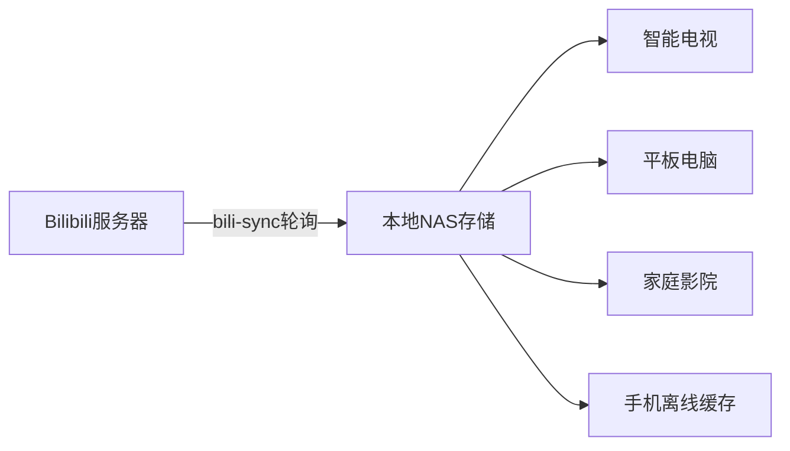

# 用开源工具构建个人B站视频档案馆——基于bili-sync与NAS的离线观影方案
## bili收藏夹视频本地部署
## 📌 痛点直击
对于Bilibili深度用户，你是否经常遭遇这样的困扰：
1. **网络干扰焦虑**：观看时强迫性刷弹幕/评论区，无法专注观影
2. **内容消失恐惧**：收藏夹突然灰掉30%、喜欢的UP主视频莫名下架
3. **画质妥协困境**：移动网络下被迫选择低码率播放

## 🛠 解决方案架构


## 🔧 技术实现详解

### 准备工作
- 支持Docker的NAS设备（群晖/威联通/TrueNAS等）
- 硬盘容量建议：按每部视频平均500MB计算，1TB≈存储2000部视频
- 获取B站Cookie（通过浏览器开发者工具获取）

### 部署流程
```bash
# 创建专用存储目录
mkdir -p /volume1/video/bilibili/{收藏夹,订阅列表}

# Docker运行命令（群晖示例）
docker run -d \
  --name bili-sync \
  -v /volume1/video/bilibili:/app/downloads \
  -e BILI_COOKIE="your_cookie_here" \
  -e SYNC_INTERVAL=3600 \
  -e VIDEO_QUALITY=120 \
  --restart unless-stopped \
  ghcr.io/user/bili-sync:latest
```

#### 参数说明表
| 环境变量         | 推荐值   | 功能说明                     |
|------------------|----------|------------------------------|
| SYNC_INTERVAL    | 3600     | 同步间隔（秒）               |
| VIDEO_QUALITY    | 120      | 1080P高码率（数值对应B站API）|
| DOWNLOAD_MODE    | aria2    | 多线程下载引擎               |
| MAX_CONCURRENCY  | 3        | 同时下载任务数               |

### 高级配置
```yaml
# config.yaml
subscriptions:
  - uid: 1234567    # UP主UID
    download_all: true
    filter: "游戏解说"  # 仅下载含特定标签的视频

collections:
  - favid: 12345    # 收藏夹ID
    quality: 74     # 720P兼容模式（旧设备优化）
```

## 🎯 体验升级报告

### 观影场景对比表
| 维度             | 传统在线模式         | 本地NAS模式           |
|------------------|----------------------|-----------------------|
| 启动延迟         | 3-5秒缓冲           | 即点即播              |
| 拖动响应         | 卡顿概率高          | 帧级精准定位          |
| 夜间观看         | 自动亮度干扰         | 定制HDR映射           |
| 字幕呈现         | 网络依赖             | 硬字幕烧录            |
| 多设备接力       | 需重新缓冲          | 播放进度秒同步        |

### 数据安全策略
1. **三重备份机制**：
    - 主存储：NAS RAID阵列
    - 增量备份：外部冷存储硬盘
    - 云端加密备份：rclone同步至加密的Google Drive

2. **自动化整理**：
```python
# 示例整理脚本
import shutil
from datetime import datetime

def organize_video(video_path):
    create_date = datetime.fromtimestamp(os.path.getctime(video_path))
    new_path = f"/archive/{create_date.year}/{create_date.month:02d}/{os.path.basename(video_path)}"
    shutil.move(video_path, new_path)
```

## ⚠️ 法律提示
1. 本方案仅适用于个人观看用途
2. 禁止将下载内容用于商业传播
3. 建议优先保存已获CC协议授权的视频
4. 定期清理非必要缓存（建议设置30天自动清理策略）

## 🌟 进阶玩法
- **家庭媒体中心集成**：通过Jellyfin/Plex实现海报墙展示
- **智能分类系统**：利用whisperAI生成视频字幕索引
- **离线弹幕系统**：同步下载精选弹幕（需修改bili-sync配置）
- **带宽节省模式**：仅下载夜间时段，利用NAS定时开机功能

> **技术优势**：相比传统录屏方案，bili-sync直接获取原始流媒体文件，平均节省50%存储空间，支持最高8K画质下载，保留杜比全景声音轨。


（图示：本地NAS与多终端播放的数据流转路径）

**扩展建议**：
1. 可在NAS部署qBittorrent实现下载加速
2. 配置WireGuard实现外网安全访问
3. 使用Tdarr进行视频转码压缩（建议保留原始文件）
4. 设置自动化RSS订阅（配合bili-sync的监听模式）

该方案将视频数据主权交还用户，建议配合网络隔离策略（如防火墙规则）实现真正的纯净观影环境。